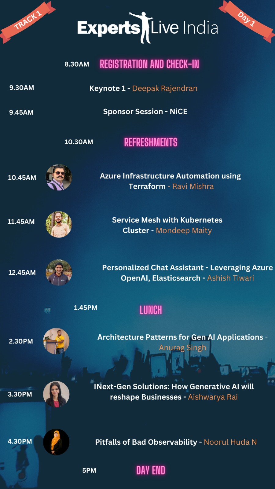
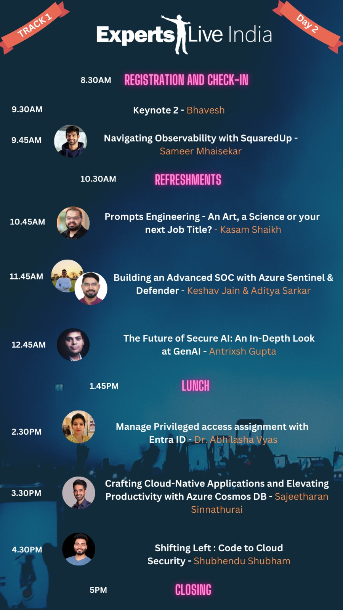
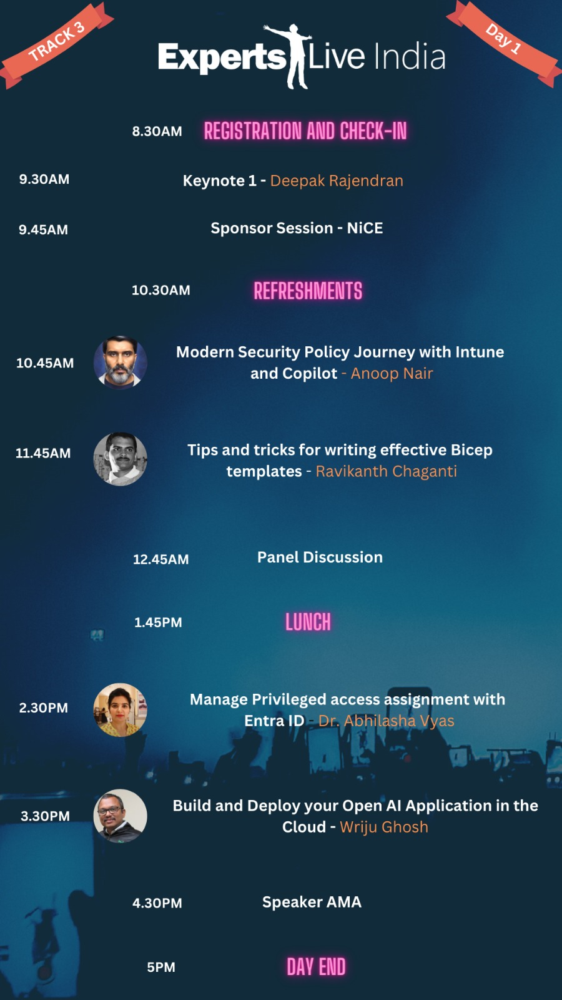
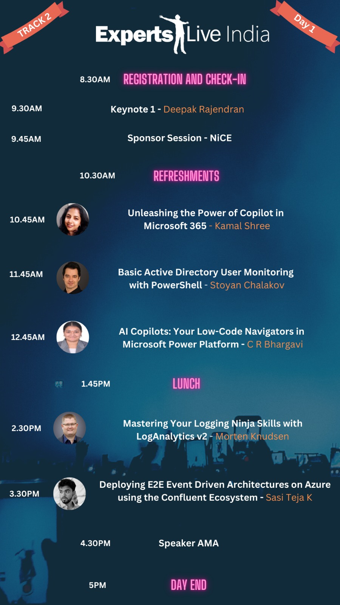
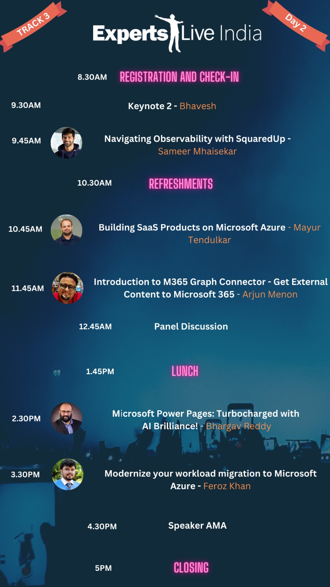
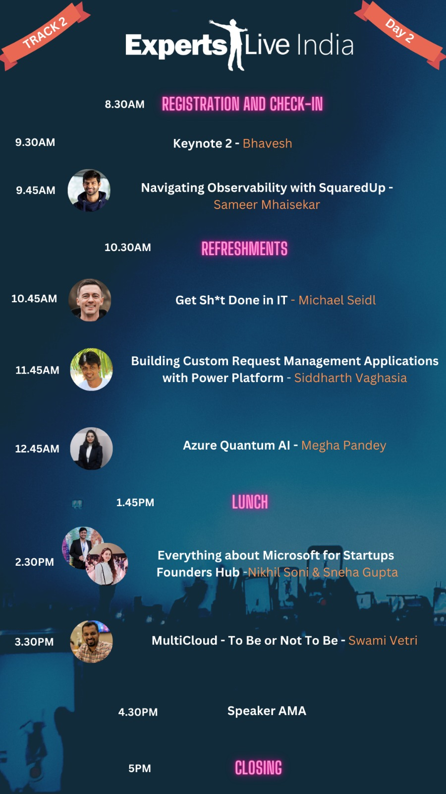

# Experts Live India - 2024

This repository has the artifacts which is used by Arjun Menon in Experts Live India for the session **Introduction to M365 Graph Connector - Get External Content to Microsoft 365 - Arjun**

## Session Information

Session Link : [Experts Live India 2024](https://expertslive.co.in/)

### Session Poster

## Session Abstract

In this session Arjun Menon will be talking about the Microsoft 365 Graph Connectors. He will be covering the following topics in this session.

1. Ingesting Public API Data to Microsoft 365
2. Ingesting another Public API Date with an enterprise level full blown application level

## Pre-requisites

Pre-requisites for the session are mentioned in each of the demo folders mentioned in the Demo Codes section.

## Demo Codes

### Demo 1 - Ingesting Public API Data to Microsoft 365
[Demo Code](./demo-codes/1.gr-cnctr-public-api/)

### Demo 2 - Ingesting another Public API Date with an enterprise level full blown application level
[Demo Code](./demo-codes/2.gr-cnctr-enterprise-full/)

## Complete Agenda

